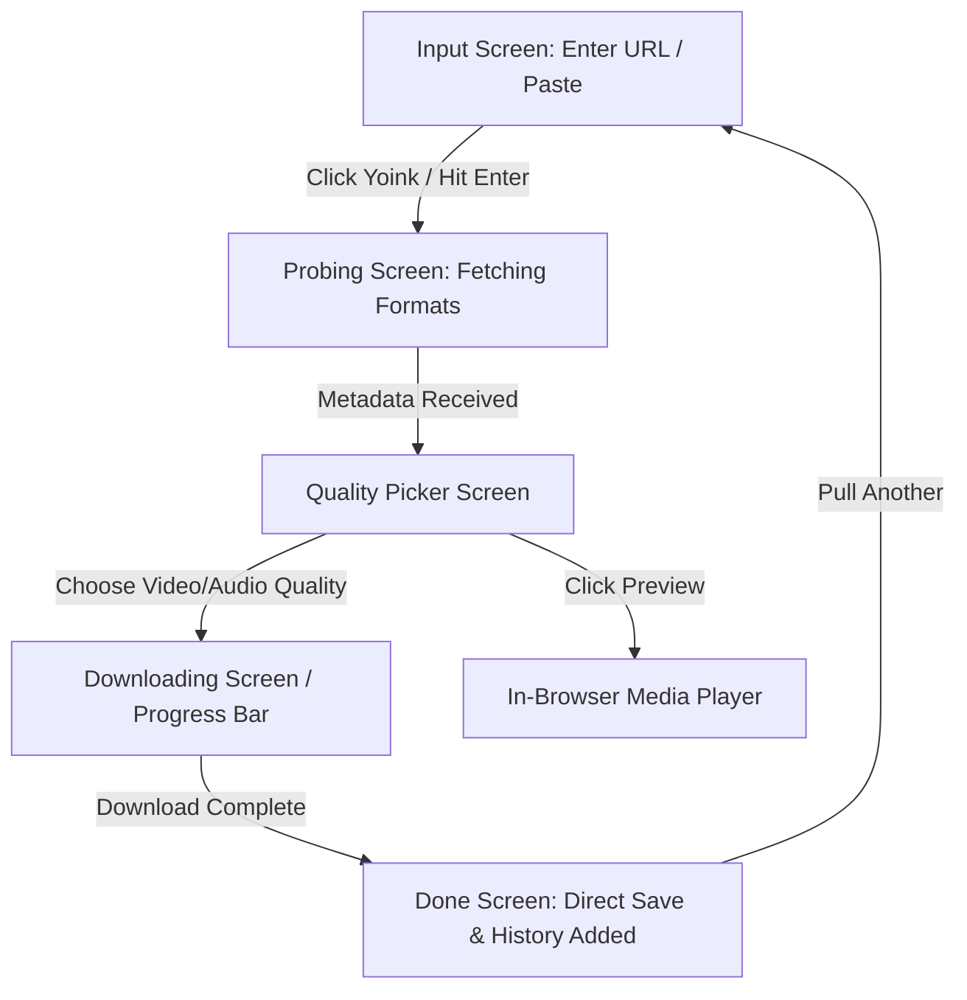

# Ripcord — Design Specification

## Overview
**Ripcord** ("pull the ripcord, grab any stream, done") is a modern, retro-terminal themed full-stack web application adapted from Pablo Stanley's open-source CLI video downloader [Yoinks](https://github.com/pablostanley/yoinks).

Ripcord preserves the playful aesthetic, monospaced typography, animated ASCII sweep logo, platform auto-detection, and clean format selection of Yoinks, while adding:
- A responsive web user interface (desktop & mobile)
- In-browser media preview player
- Local download history (persisted in `localStorage`)
- Vercel-ready serverless backend architecture for video probing and downloading

---

## Architecture & Tech Stack

### Frontend
- **Framework:** Next.js 14+ (App Router) with React 18/19 and TypeScript.
- **Styling:** Tailwind CSS + custom retro terminal styling (monospaced fonts, box-drawing characters, dark/light theme tokens).
- **Icons & Graphics:** ASCII animated banner + SVG platform badges.
- **State Management:** React hooks state machine (`input` → `probing` → `picking` → `downloading` → `done` / `error`).
- **Storage:** `localStorage` for Ripcord History (persisting last 20 downloaded streams).

### Backend / Serverless API
- **API Routes (Next.js App Router):**
  - `POST /api/probe`:
    - Validates incoming URL.
    - Resolves `yt-dlp` executable (system binary in dev, cached `/tmp` binary in Vercel serverless Linux environment).
    - Runs `yt-dlp -J --no-playlist [url]`.
    - Parses video metadata: title, duration, author, thumbnail, webpage URL, and extracted formats.
    - Normalizes video choices (e.g. 1080p, 720p, 480p, 360p mp4 + MP3 audio) with estimated file sizes.
  - `GET /api/download`:
    - Accepts `url`, `formatId`, and `title`.
    - Downloads/processes video stream via `yt-dlp` to `/tmp` (or pipes directly), merging video+audio with `ffmpeg` if required.
    - Streams file directly to browser with `Content-Disposition: attachment; filename="[title].[ext]"` and proper MIME types.
  - `GET /api/stream`:
    - Provides a streaming URL for the in-browser video/audio preview player.

### Deployment & Vercel Considerations
- `vercel.json` configured with `maxDuration: 60` (or plan maximum) for download/probe routes.
- Binary manager (`lib/ytdlp-server.ts`) automatically manages and permissions the standalone `yt-dlp` binary in `/tmp` when running on AWS/Vercel serverless functions.
- Fully runnable locally via standard `npm run dev` with auto-download of platform-specific binary.

---

## User Experience Flow



1. **Input Phase:**
   - Central framed terminal box.
   - Text input with auto-paste from clipboard button.
   - Live platform detector pill badge (YouTube, X / Twitter, Instagram, TikTok, Threads, Reddit, Vimeo, Twitch, Facebook, Bluesky).
   - "Pull Ripcord" primary action button (`Enter` key supported).
   - History button showing count of previously saved videos.

2. **Probing Phase:**
   - Retro animated spinner (`⠋ ⠙ ⠹ ⠸ ⠼ ⠴ ⠦ ⠧ ⠇ ⠏`) + "resolving stream info...".
   - Escape / Cancel button to return to input.

3. **Format Selection Phase:**
   - Media card with video thumbnail, title, channel name, and duration badge.
   - List of format options:
     - Sorted video qualities (4K, 1440p, 1080p, 720p, 480p, 360p) with container (mp4) and estimated file size.
     - Audio-only MP3 option with estimated bitrate and size.
   - Navigable with Keyboard (`↑`/`↓` and `Enter`) or mouse click.
   - "Preview Stream" button to inspect media in-browser.

4. **Downloading & Processing Phase:**
   - ASCII terminal progress bar: `[████████████░░░░░░] 68%`.
   - Live download metrics: downloaded bytes, total size, speed (MB/s), ETA.
   - Multi-part status indicator (`part 1/2` for video then audio extraction/merging).

5. **Done Phase:**
   - Success badge with filename and size.
   - Immediate automatic file trigger to the browser's download manager.
   - Secondary actions: "Re-download", "Play in Previewer", "Pull Another Link" (`Enter`).
   - Automatically appended to Ripcord History.

6. **Media Preview Modal:**
   - Overlay containing retro HTML5 video/audio player with custom terminal skin.

7. **History Drawer:**
   - Slide-out terminal drawer listing past downloads with thumbnails, titles, timestamps, and quick action to re-probe/re-download.

---

## Component Structure

```
ripcord/
├── app/
│   ├── api/
│   │   ├── probe/
│   │   │   └── route.ts       # POST: metadata extraction & format choices
│   │   ├── download/
│   │   │   └── route.ts       # GET: file download & stream handling
│   │   └── stream/
│   │       └── route.ts       # GET: in-browser preview stream
│   ├── globals.css            # Terminal styling & animations
│   ├── layout.tsx             # Root layout with theme provider & metadata
│   └── page.tsx               # Main Ripcord terminal page
├── components/
│   ├── AsciiLogo.tsx          # Canvas/CSS matrix shimmer sweep animation
│   ├── FramedBox.tsx          # Retro terminal border container
│   ├── InputPhase.tsx         # URL input, paste button, platform pills
│   ├── ProbingPhase.tsx       # Animated spinner & status
│   ├── PickingPhase.tsx       # Quality options list & media metadata card
│   ├── ProgressPhase.tsx      # Terminal progress bar & speed/ETA stats
│   ├── DonePhase.tsx          # Completion details & actions
│   ├── MediaPreviewModal.tsx  # In-browser video/audio player modal
│   ├── HistoryDrawer.tsx      # Slide-out history drawer
│   ├── ShortcutsBar.tsx       # Terminal keyboard shortcut hints
│   └── ThemeToggle.tsx        # Dark / Light / Auto switcher
├── lib/
│   ├── format.ts              # Byte formatting, duration, speed calculations
│   ├── platforms.ts           # URL parsing & platform detection logic
│   ├── ytdlp-server.ts        # Server-side yt-dlp binary resolver & runner
│   ├── choices.ts             # Format parsing & candidate selection
│   └── history.ts             # Client localStorage history helpers
└── vercel.json                # Vercel deployment configuration
```

---

## Verification & Testing
1. **API Verification:**
   - Test `POST /api/probe` with YouTube, Twitter/X, and Instagram links.
   - Test `GET /api/download` with standard quality choices and audio extraction.
2. **UI Verification:**
   - Test keyboard shortcuts (`Enter`, `Esc`, `↑`/`↓` navigation).
   - Test dark, light, and auto themes.
   - Test in-browser media preview player.
   - Test localStorage history persistence and clear history.
3. **Build & Production Check:**
   - `npm run build` passes with zero type errors.
   - `npm run start` serves the production build properly.
